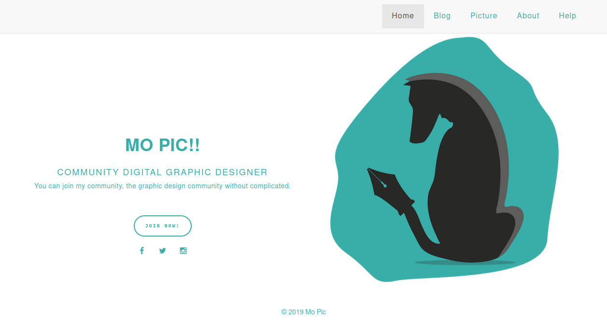

# Final Task Group 2nd Semester

This first website build with my group,

### Build with

- html
- css
- javascript
- bootstrap (Version 3 | Include fontawesome)

### Screenshot

  
Click here for view

  

### How to use ?

1. paste file in directory local server
2. change name file "htaccess" to ".htaccess"
3. enjoy

### Name

- [Dhenys - Leader](https://www.instagram.com/)
- [Mutia](https://www.instagram.com/mutiaaaaas/)
- [Syifa](https://www.instagram.com/syifauziap/)
- [Effrain](https://www.instagram.com/effrainsrt_/)

### Thanks to :

- colorlib
- bootstrap

---

Build Date : 2019
